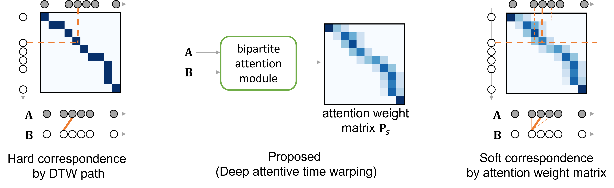
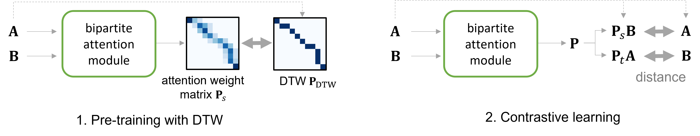

# Deep Attentive Time Warping [[S.Matsuo+, PR2023](https://arxiv.org/abs/2309.06720)]
Shinnosuke Matsuo, Xiaomeng Wu, Gantugs Atarsaikhan, Akisato Kimura, Kunio Kashino, Brian Kenji Iwana, Seiichi Uchida
[[Publishersite](https://www.sciencedirect.com/science/article/pii/S003132032200680X)]



This code is also used in [Attention to Warp: Deep Metric Learning for Multivariate Time Series [S.Matsuo+, ICDAR2021]](https://arxiv.org/abs/2103.15074).

>Similarity measures for time series are important problems for time series classification. To handle the nonlinear time distortions, Dynamic Time Warping (DTW) has been widely used. However, DTW is not learnable and suffers from a trade-off between robustness against time distortion and discriminative power. In this paper, we propose a neural network model for task-adaptive time warping. Specifically, we use the attention model, called the bipartite attention model, to develop an explicit time warping mechanism with greater distortion invariance. Unlike other learnable models using DTW for warping, our model predicts all local correspondences between two time series and is trained based on metric learning, which enables it to learn the optimal data-dependent warping for the target task. We also propose to induce pre-training of our model by DTW to improve the discriminative power. Extensive experiments demonstrate the superior effectiveness of our model over DTW and its state-of-the-art performance in online signature verification.

## Requirements
* python >= 3.9
* cuda && cudnn

We strongly recommend using a virtual environment like Anaconda or Docker. The following is how to build the virtual environment for this code using anaconda.
```
# pytorch install (https://pytorch.org/get-started/locally/)
$ pip3 install torch torchvision torchaudio --index-url https://download.pytorch.org/whl/cu118
$ pip install -r requirements.txt
```

## Training&Test Examples

```
# src/main.py

import torch
import numpy as np
from DATW import DATW
from utils import load_ucr_dataset

X_train, y_train, X_test, y_test = load_ucr_dataset(dataset_name='ECG200')
"""
X_train: (num_train_data, length, channel)
y_train: (num_train_data, )
X_test: (num_test_data, length, channel)
y_test: (num_test_data, )
"""

datw = DATW(batch_size=64,
            lr=1e-4,
            pre_training_num_epochs=10,
            pre_training_iteration=100,
            contrastive_learning_num_epochs=20,
            contrastive_learning_iteration=500,
            tau=1,
            k=3,
            seed=42,
            device='cuda:0',
            best_model=None)

datw.pre_training(X=X_train, y=y_train)
datw.contrastive_learning(X=X_train, y=y_train)
prediction = datw.predict(X_ref=X_train, y_ref=y_train, 
                          X_test=X_test, y_test=y_test)
torch.save(datw.best_model, 'DATW_model.pkl')
print('Accuracy: %.4f' % np.array(prediction==y_test).mean())  
```

## Distance calculation for a pair
```
X1 = X_train[0] # (legth, channel)
X2 = X_test[0] # (legth, channel)

model = torch.load('DATW_model.pkl')
datw = DATW(device='cuda:0',
            best_model=model)
dist = datw.cal_dist(X1, X2)
```

## Citation
If you find this repository helpful, please consider citing:
```
@article{MATSUO2023109201,
  title = {Deep attentive time warping},
  author = {Shinnosuke Matsuo and Xiaomeng Wu and Gantugs Atarsaikhan and Akisato Kimura and Kunio Kashino and Brian Kenji Iwana and Seiichi Uchida},
  journal = {Pattern Recognition},
  volume = {136},
  pages = {109201},
  year = {2023},
}
```
```
@inproceedings{matsuo2021attention,
  title={Attention to Warp: Deep Metric Learning for Multivariate Time Series},
  author = {Shinnosuke Matsuo and Xiaomeng Wu and Gantugs Atarsaikhan and Akisato Kimura and Kunio Kashino and Brian Kenji Iwana and Seiichi Uchida},
  booktitle={International Conference on Document Analysis and Recognition (ICDAR)},
  year={2021},
}
```